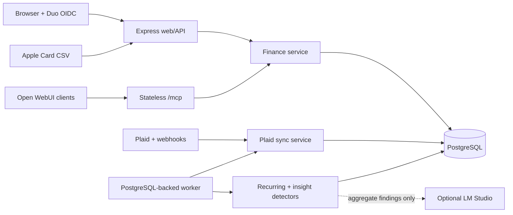

# Money

Money is a shared personal-finance dashboard and scoped MCP server for
`money.example.com`. It imports accounts through Plaid and Apple Card CSV,
stores normalized finance data in PostgreSQL, produces deterministic insights,
and gives Open WebUI structured results that compatible clients can render as native
cards.

The stack is deliberately boring: Node 24, Express 5, EJS, vanilla JavaScript,
Chart.js, PostgreSQL, and the official MCP SDK. There is no TypeScript, ORM,
Redis, GraphQL, or frontend framework hiding under the couch.

## What it does

- Shared dashboard for net worth, spending, cash flow, accounts, recurring
  payments, investments, and recent transactions.
- Cash Balance, Short-Term Worth, and complete Net Worth totals with account
  inventory in the user menu, Settings-based account editing,
  All/Trading/Retirement portfolio views, and manually valued assets such as
  homes and vehicles.
- A dedicated Credit view with manual per-person score tracking, an
  equal-weight household planning average, stale/duplicate warnings, weighted
  utilization, truthful local history, and a per-card breakdown.
- Admin transaction cleanup in Settings with a persistent list of exact-match
  rules plus deterministic fuzzy suggestions for one-time edits. Rules can
  rename merchants, set categories, and replace or clear tags for existing and
  future transactions. Provider names stay immutable and searchable.
- Three deterministic insight families: weekly spending changes, investments,
  and subscriptions.
- Plaid Transactions, Investments, and Liabilities ingestion with webhook and
  cursor handling.
- Admin-only Apple Card USD CSV preview and idempotent import, with manual
  balance, credit-limit, and as-of snapshots. Uploaded files are parsed in
  memory and never persisted.
- Duo OIDC login. Every allowlisted user sees the same workspace; only admins
  may connect institutions or change shared finance data. Each member may
  manage only their own manually tracked credit-score sources.
- Fifteen read tools plus nine audited planning-write MCP tools at `POST /mcp`.
  Read and `plan:write` credentials are separate.
- Optional LM Studio narratives generated only from precomputed findings.
  Balances, metrics, MCP data, and detector decisions never come from the model.

## Architecture



The web server and worker use the same image but run as separate Nomad tasks.
The prestart migration task updates the schema before either application task
becomes healthy.

## Local demo

Requirements: Node.js 24 and npm 11.

```bash
npm ci
cp .env.example .env
npm run dev
```

The example file defaults to `DEMO_MODE=true` and `AUTH_MODE=mock`. Open
`http://127.0.0.1:3000`. Demo mode uses deterministic fixtures and does not
contact PostgreSQL, Plaid, Duo, or LM Studio.

Mock authentication is rejected when `NODE_ENV=production`.

Run the test suite:

```bash
npm test
```

HTTP tests bind an ephemeral loopback port. A locked-down sandbox may reject
that with `listen EPERM`; run the same command in the normal host or CI rather
than declaring victory over a test that never opened a socket.

## PostgreSQL and Plaid Sandbox

1. Start PostgreSQL 17 and create a dedicated database/user.
2. Copy `.env.example` to `.env`.
3. Set `DEMO_MODE=false`, `DATABASE_URL`, `PLAID_CLIENT_ID`,
   `PLAID_SECRET`, and `PLAID_ENV=sandbox`.
4. Keep `AUTH_MODE=mock` for local-only development.
5. Apply the schema, then start the web process and worker:

```bash
npm run migrate
npm run dev
```

```bash
npm run start:worker
```

Sign in as the local mock admin, open Settings, and connect a Plaid Sandbox
institution. Plaid documents its test institutions and credentials in the
[Sandbox guide](https://plaid.com/docs/sandbox/) and the complete Link flow in
the [Quickstart](https://plaid.com/docs/quickstart/).

Apple Card imports live under Settings → Connections. Preview and confirm use
separate multipart requests; confirm must include the digest returned by the
preview. The supported routes are:

- `POST /api/v1/apple-card/imports/preview`
- `POST /api/v1/apple-card/imports`
- `PATCH /api/v1/apple-card/account`
- `DELETE /api/v1/apple-card/connection`

All four routes require an authenticated admin and CSRF protection.

Manual credit-score tracking lives on the Credit page. Shared reads use
`GET /api/v1/credit-scores`; source and dated-observation mutations are
authenticated and CSRF-protected. The service scopes every write to the
signed-in workspace member instead of accepting an owner ID from the request.
See [Manual credit-score tracking](docs/manual-credit-scores.md) for the
calculation and API contract.

Plaid Sandbox and Production Items are separate. Never point a Sandbox database
at Production credentials and expect the Items to migrate; they will not.

### Data and secret boundary

- Static deployment secrets come from Nomad Variables in production.
- Plaid access tokens are created at runtime and stored as plaintext in the
  service-only `plaid_item_secrets` table. They are not static Nomad values.
- `migrations/002_secret_role_boundary.sql` revokes public access to that table.
  The application database role needs access; analytics/reporting roles do not.
- Because v1 intentionally has no application-layer token encryption,
  PostgreSQL access, backups, replicas, and dumps are all secret-bearing
  surfaces. Treat them accordingly.

## Duo OIDC

Production requires `AUTH_MODE=oidc`. Create a Duo **Generic OIDC Relying
Party**, register
`https://money.example.com/auth/duo/callback` as its sign-in redirect URL, and
enable the `openid`, `email`, and `profile` scopes.

Copy the issuer, client ID, and client secret from Duo's Metadata tab into
`DUO_OIDC_ISSUER`, `DUO_CLIENT_ID`, and `DUO_CLIENT_SECRET`. Money loads the
provider metadata from
`${DUO_OIDC_ISSUER}/.well-known/openid-configuration`; do not hand-build the
authorization, token, or JWKS endpoints.
`DUO_AUTHORIZATION_URL` and `DUO_TOKEN_URL` are optional consistency checks
against discovery. Leave them empty to trust the discovered values.
`DUO_REDIRECT_URI` defaults to the Money callback on `PUBLIC_BASE_URL` and
must exactly match the redirect URL registered in Duo.

Money uses Authorization Code with PKCE S256, one-time state and nonce values,
RS256/JWKS verification, and exact issuer/audience checks. It discards Duo
tokens after extracting the identity. `DUO_ALLOWED_EMAILS` is the login
allowlist. `DUO_ADMIN_EMAILS` must be a subset and grants
connection/classification/settings mutations; it does not create a separate
finance workspace. Browser sessions have an eight-hour absolute lifetime and
re-evaluate both lists on every request, so access and admin changes do not
linger in an old session. Use at least 32 random bytes for `SESSION_SECRET`.

Do not use `api-*.duosecurity.com/oauth/v1/*` here. That is Duo's MFA-only Auth
API, not the full SSO issuer, and it does not perform primary authentication.
The issuer for this app comes from the Generic OIDC Relying Party Metadata tab
and uses the `sso-*.sso.duosecurity.com/oidc/...` host/path. See Duo's
[Generic OIDC Relying Party guide](https://duo.com/docs/sso-oidc-generic).

## MCP

The public MCP endpoint is `https://money.example.com/mcp`. Browser OIDC
sessions do not authorize it. `MCP_BEARER_TOKEN` discovers read tools only;
the distinct `MCP_PLAN_WRITE_TOKEN` also discovers audited planning writes.

The Open WebUI connection ID is **`money`** and the model tool attachment ID is
**`server:mcp:money`**. See [Open WebUI setup](docs/open-webui.md) for
configuration, discovery, curl, and SDK smoke tests.

### Tools

The read credential discovers the fifteen read tools. The `plan:write`
credential discovers those same tools plus all nine writes.

<!-- mcp-tool-table:start -->
| Access | Area | Tool | Capability |
| --- | --- | --- | --- |
| `read` | Finance | `get_finance_overview` | Current net worth, assets, liabilities, cash, spending, and cash-flow headline. |
| `read` | Finance | `get_finance_insights` | Deterministic weekly spending, investment, and subscription findings. |
| `read` | Finance | `list_accounts` | Paginated bank, credit, loan, and investment accounts with balances and sync freshness. |
| `read` | Finance | `list_transactions` | Paginated ledger search by date, text, account, category, status, and amount. |
| `read` | Finance | `get_spending_summary` | Spending totals, comparisons, series, and category, merchant, or account breakdowns. |
| `read` | Finance | `get_cash_flow` | Posted income, spending, net cash flow, and interval buckets. |
| `read` | Finance | `list_recurring_payments` | Detected subscriptions and bills with cadence, normalized cost, confidence, and estimated dates. |
| `read` | Finance | `get_net_worth_history` | Historical asset, liability, and net-worth snapshots. |
| `read` | Finance | `get_portfolio_summary` | Holdings, allocation, value history, cash flows, and supported performance evidence. |
| `read` | Finance | `get_credit_score_summary` | Manually tracked scores, freshness, household average, and history; not an underwriting score. |
| `read` | Planning | `get_safe_to_spend` | Liquid cash minus positive card balances and cash-backed goal earmarks. |
| `read` | Planning | `list_finance_goals` | Active or finished goals, funding, schedules, attributed spending, remaining amounts, and shortfalls. |
| `read` | Planning | `get_budget_status` | One month's posted category spending against the standing monthly budget. |
| `read` | Planning | `model_finance_plan` | Deterministic goal-funding and brokerage-change scenario arithmetic. |
| `read` | Planning | `get_transaction_goal_spending` | A transaction's goal-spending links, unassigned amount, and current write versions. |
| `plan:write` | Planning | `create_finance_goal` | Create a household goal with a purpose, target, and optional date. |
| `plan:write` | Planning | `update_finance_goal` | Change goal details or target using optimistic version control. |
| `plan:write` | Planning | `allocate_finance_goal` | Add or release a virtual cash or brokerage earmark without moving money. |
| `plan:write` | Planning | `set_goal_funding_schedule` | Create or edit monthly or alternate-Friday virtual funding. |
| `plan:write` | Planning | `finish_finance_goal` | Complete or cancel a goal while preserving its frozen plan and history. |
| `plan:write` | Planning | `set_category_budget` | Create or update a persistent monthly category budget. |
| `plan:write` | Planning | `split_transaction` | Replace or clear category splits without changing provider data. |
| `plan:write` | Planning | `spend_from_finance_goal` | Attribute a posted outflow to a goal without making a payment, transfer, sale, or trade. |
| `plan:write` | Planning | `reverse_goal_spend` | Reverse one goal-spending attribution while retaining audit history. |
<!-- mcp-tool-table:end -->

Each successful tool call returns:

1. A concise, self-contained text block for the model.
2. A minified canonical JSON compatibility block.
3. The identical rich object in MCP `structuredContent`.

The structured envelope uses schema `com.yaboiii.finance-card`, version `1`,
and is capped at 20,000 UTF-8 bytes. The JSON block exists because some
intermediaries serialize MCP output and discard native `structuredContent`.
Native clients should prefer `structuredContent`, fall back only to the JSON
block, and never scrape the prose.

## Operations

Health endpoints:

- `GET /health/live`: process liveness.
- `GET /health/ready`: required configuration plus PostgreSQL readiness.

Production runs:

- `npm run migrate` as a one-shot Nomad prestart task.
- `npm run start:web` as the HTTP service.
- `npm run start:worker` as the PostgreSQL queue consumer.

The worker processes Plaid sync, recurring detection, and insight generation.
LM Studio is optional: leave its model blank to keep deterministic findings
without generated narrative.

Deployment uses the SHA-tagged multi-architecture image published by GitHub
Actions. Never deploy `latest`; use
`ghcr.io/francisschmaltz/money:sha-FULL_COMMIT_SHA`. Full setup, variable
placeholders, rollout, and rollback checks live in
[Nomad deployment](docs/nomad/README.md).

## Privacy rules

- Do not log MCP bodies, Plaid payloads/tokens, balances, amounts, merchants,
  descriptions, cookies, or evidence rows.
- Never persist Apple Card CSV bytes or filenames. Import audit rows contain
  only the file digest, date coverage, counts, actor, and import time.
- Do not expose secrets through health checks, errors, search, exports, admin
  responses, or native card payloads.
- The MCP bearer grants read access to the entire shared workspace. Store and
  rotate it like a database credential.
- Manually entered credit scores are visible to the shared workspace and MCP.
  MCP output omits emails, names, member IDs, and mutation controls.
- LM Studio receives deterministic aggregate findings only, never raw
  transactions.
- Removing a Plaid Item calls `/item/remove`, deletes its token, and purges
  local rows unless an admin explicitly retains archived history.

## Repository map

| Path | Purpose |
| --- | --- |
| `app/app.js` | Express composition, health, stateless MCP transport |
| `app/services/` | Analytics, sync, recurring, insights, optional narrative |
| `app/mcp/` | Tool schemas, envelope validation, canonical dual output |
| `app/db/` | PostgreSQL repositories, job queue, migration runner |
| `app/views/`, `app/public/` | EJS dashboard and local browser assets |
| `migrations/` | Forward, idempotently tracked SQL migrations |
| `docs/nomad/` | Nomad job, variable template, and deployment runbook |

The balance formulas, inferred account groups, retirement scopes, and manual
asset rules are documented in [Wealth totals and account groups](docs/wealth-model.md).
The action hierarchy, finding lifecycle, feedback boundary, and investment-risk
limits are documented in [Action-first insights](docs/insights.md).
